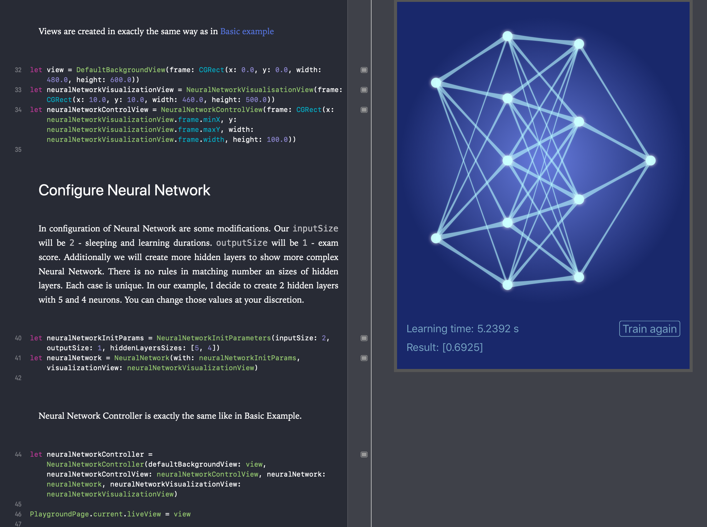

# Overview
Repository contains accepted application for WWDC 2017 Schoolarship. It is a Xcode Playground. It aims to present fully functional, multidimensional, feed-forwarded Neural Network implementation as a method of machine learning.

# Basic info
Swift 3.0

Xcode 9.0

## License

Please note the LICENSE before making modifications to it.

Copyright (c) 2018 Rafał kitta
